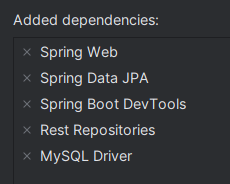
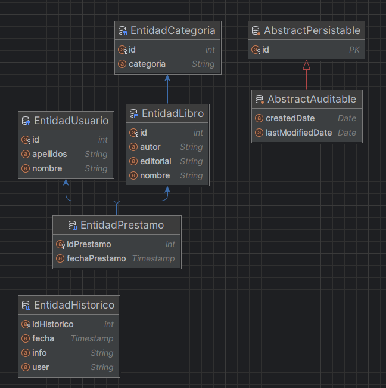

# Proyecto Gestión BibliotecaSpringBoot 🚀


## Integrantes del Grupo 👥

- 👨‍💻 Juan Manuel
- 👨‍💻 Sebastián
- 👨‍💻 Eric


## Objetivo del Trabajo 🎯
**1. Gestión de una base de datos, basada en una biblioteca usando SpringBoot.**

El objetivo de esta interesante práctica es aprovechar la facilidad y portabilidad que nos ofrece el framework de Spring Boot (extension de Spring) 
para crear y manejar clases que están asociadas a tablas en una base de datos, todo ello en un 
periodo de tiempo muy inferior a como resultaría utilizando un modelo JPA o SQL convencional.

***Ventajas de usar Spring Boot:***
    - Simplifica y acelera el desarrollo de aplicaciones Java. <br>
    - Está diseñado para crear aplicaciones autónomas con una configuración mínima. <br>
    - Autoconfiguración: Proporciona autoconfiguración inteligente basada en las dependencias presentes en el proyecto. <br>
    - Desarrollo Rápido: Facilita la creación de aplicaciones con un rápido desarrollo y despliegue. <br>


**2. Mantener el modelo MVC (modelo-vista-controlador).**

Podemos aprovechar la potencia y el resultado de la devolución de objetos por parte del uso de los controladores en conjunto con los métodos que se basan en las solicitudes 
HTTP para asi mantener la integridad del MVC
sin muchas alteraciones, asegurando así una arquitectura organizada y sobre todo escalable.

**3. Patrón Observer.**

La idea principal consiste en mantener el patron Observer como viene planteado de anteriores prácticas,
ya que la declaración del método se ha mantenido sin alteraciones desde la práctica hibernate.

# Parte Back-End (Spring Boot)

Para implementar este back-end, que será totalmente independiente del front-end (ya que es un micro servicio), hemos seguido los siguientes pasos:

 ## Creación del Proyecto 🛠️

 Creamos un nuevo proyecto usando IntelliJ, de tipo Spring Initializr.
 Seleccionamos las dependencias de Spring que aparecen en la imagen que son las que nos van a hacer falta para poder hacer una API-REST, 
 y finalmente añadimos las facetas JPA y Web a el proyecto de IntelliJ.



 ## Implementación del modelo 🔦

 Una vez configurado el proyecto inicial, creamos el paquete `modelo`.
 Este paquete contendrá las entidades y los repositorios de estas.
 Los repositorios son interfaces que extienden de CrudRepository y que nos permiten hacer consultas a la base de datos de una forma muy sencilla.
 Gracias al maravilloso Spring Boot.

 Todo ello agregando la faceta JPA sobre Hibernate y para acabar realizando el mapeo de las clases entidades o POJO de cuales empezaremos a partir.

## Mapeado de entidades 🗺️

Para mapear las entidades, usamos la pestaña `Persistence` de IntelliJ, y seleccionamos la opción `Generate Persistance Mapping`, como hemos hecho otras veces.

Teniendo en cuenta la consideración de que a ser posible en el caso de la tabla `prestamos` a la hora de unirla con la tabla libro y usuario para así formar un préstamo,
se referencien estas llaves foráneas en préstamo como un objeto o entidad y así mejorar la portabilidad de la clase y por ende la de la aplicación.

En la imagen podemos apreciar como se han mapeado las entidades de la base de datos.



## Implementación controlador 🎮

En esta parte de la implementación se ha creado el paquete `controladores` que es quien contiene las clases directamente relacionadas con las tablas y
<b>controlaran</b> como su nombre indica, el flujo de datos que recibimos a través de los endpoint hacia la base de datos, básicamente serán validados y manejados con anotaciones
propias del framework como <b>@Validated</b> o <b>@PostRequest</b> para dirigir las consultas y asegurar la persistencia en nuestros objetos.

## Empaquetado y Despliegue 📦

Una vez que hemos implementado todas las clases y métodos necesarios, empaquetamos el proyecto con Maven a un jar.
Para ello, en la pestaña de IntelliJ de Maven, ejecutamos el comando `Lifecycle -> Package` y se generará un jar en la carpeta target del proyecto.
El cual podremos ejecutar con el comando `java -jar nombreDelJar.jar` y se desplegará en el puerto 8080 por defecto.

# Parte Front-End
Para el front-end, hemos decidido mantener la estructura de la práctica anterior, ya que el objetivo de esta práctica es 
centrarnos en el back-end y no en el front-end.

Por lo tanto, hemos mantenido las interfaces de las clases DAO, Observer y POJOS (Aunque ahora sin estar conectados a JPA, son POJOS simples), 
y hemos añadido la clase de solicitudes HTTP, además de modificar todas las implementaciones de cada Clase DAO.

## Solicitudes HTTP
Esta es la clase que implementa toda la comunicación con Spring Boot a traves de la API-REST que hemos creado. 
Está compuesta por 4 métodos estáticos, más concretamente los métodos CRUD clásicos (Create, Read, Update & Delete).
A continuación una breve explicación de la función para cada clase:

#### deleteRequest(String pUrl) ↩️
Este método realiza una solicitud HTTP DELETE a la URL proporcionada. Si la respuesta del servidor es 200 (éxito), devuelve true.
Si no, lanza una excepción con un mensaje de error.

#### putRequest(String pUrl, String json) ↪️
Este método realiza una solicitud HTTP PUT a la URL proporcionada, enviando un objeto JSON como cuerpo de la solicitud. 
Si la respuesta del servidor es 200 (éxito), devuelve true. Si no, lanza una excepción con un mensaje de error.

#### getRequest(String pUrl) ⬇️
Este método realiza una solicitud HTTP GET a la URL proporcionada. Si la respuesta del servidor es 200 (éxito), devuelve un JSONArray con la respuesta del servidor.
Si no, lanza una excepción con un mensaje de error.

#### getRequestObject(String pUrl) ⤵️
Este método realiza una solicitud HTTP GET a la URL proporcionada. Si la respuesta del servidor es 200 (éxito), devuelve un JSONObject con la respuesta del servidor.
Si no, lanza una excepción con un mensaje de error.

#### postRequest(String pUrl, String json) ⬆️
Este método realiza una solicitud HTTP POST a la URL proporcionada, enviando un objeto JSON como cuerpo de la solicitud. Si la respuesta del servidor es 200 (éxito),
devuelve true. Si no, lanza una excepción con un mensaje de error.


## Implementación clases DAO ⚛️

Las interfaces se han mantenido, ya que la declaración de los métodos son iguales, lo hicimos de esta manera, para que no hubiera que hacer cambios en la vista de la aplicación. 
Ya que lo que devuelven los metodos es lo mismo.

Y para la implementación en este apartado hemos hecho uso de las clases de solicitudes HTTP que hemos implementado en la parte front-end.
Cada sentencia llama a un método de la clase de solicitudes HTTP y devuelve el resultado de la consulta.

Por ejemplo, en el método `leerAllPrestamos`:

```java 
@Override
public List<Prestamo> leerAllPrestamos() throws Exception {
        List<Prestamo> prestamos= new ArrayList<>();
        JSONArray jsonArray = SolicitudesHTTP.getRequest(URL.PRESTAMOS);

        for (int i = 0; i < jsonArray.length(); i++) {
        JSONObject jsonObject = jsonArray.getJSONObject(i);

        JSONObject jsonLibro = jsonObject.getJSONObject("libro");
        JSONObject jsonUsuario = jsonObject.getJSONObject("usuario");

        prestamos.add(new Prestamo(jsonObject.getInt("idPrestamo"),
        jsonLibro.getInt("id"),
        jsonUsuario.getInt("id"),
        LocalDateTime.parse(jsonObject.getString("fechaPrestamo"), DateTimeFormatter.ISO_OFFSET_DATE_TIME)));
        }

        return prestamos;
        }
```

Podemos ver como se hace uso de la clase de solicitudes HTTP para obtener un JSONArray con todos los préstamos, 
le enviamos la URL que tenemos guardada de forma estatica en un fichero de configuración de los endpoint y 
posteriormente se recorre el JSONArray para obtener los objetos JSON y desgranarlos en objetos de tipo Prestamo.
Los cuales metemos en una lista y devolvemos.

Sucesivamente fuimos haciendo que todos los métodos de nuestras clases DAO fuera haciendo uso de estos métodos para automatizar la devolución de objetos JSON e ir posteriormente desgranándolos.

Cabe comentar que para los métodos OR, hay una funcionalidad y es que en Spring podemos hacer uso de métodos OR por ejemplo: `findByNombreOrAutorOrEditorial` y automáticamente va seleccionando que en el
caso de libro sea por nombre o autor o ... lo que declaremos para no tener que hacerlo manualmente y dando el método directamente como resultado una lista del objeto según los haya encontrado.

### Clase URL

En esta clase simplemente hemos declarado las URL de los endpoint que vamos a usar en la aplicación, para no tener que estar escribiendo la URL en cada método de las clases DAO.
Y si en un futuro cambia la URL, solo tendremos que cambiarla en un único lugar.

```java
public class URL {
    public static final String BASE_URL = "http://localhost:8080";
    public static final String ENDPOINT = "/api-rest";
    public static final String LIBROS = BASE_URL + ENDPOINT + "/libros";
    public static final String CATEGORIAS = BASE_URL + ENDPOINT + "/categorias";
    public static final String USUARIOS = BASE_URL + ENDPOINT + "/usuarios";
    public static final String PRESTAMOS = BASE_URL + ENDPOINT + "/prestamos";
    public static final String HISTORICO = BASE_URL + ENDPOINT + "/historico";
    public static final String LOGIN = BASE_URL + "/login";

    public static String user = "Grupo Umpa Lumpa";
}
```

### Observer

Aquí directamente tampoco ha habido modificaciones. 
Ya que cuando una función termina de hacer su labor se activa el observer al igual que con la práctica de hibernate para notificar y avisar.

### POJOS

Para ello, simplemente usamos los mismos POJOS que teníamos en la práctica de hibernate, pero eliminando las anotaciones de JPA, ya que no las necesitamos. 
Por lo que se vuelven POJOS simples. 
La única modificación que hemos hecho es que hemos sobrescrito el método
toString y la novedad es que hemos creado 2 nuevos métodos, uno llamado
`toJSONObject` donde se usa el método put para formar un `JSONObject` de cada tabla y otro llamado 
`toJSON` que devuelve el JSON del objeto como un string, que luego usaremos en la implementación.

## Problemas Encontrados y Soluciones Aportadas 🚧

- Configuración del end-point en la cabecera de las clases controlador, en el @RequestMapping para que funcionase bien tuvimos que añadirlo asi, para libro por ejemplo: <b> "/api-rest/libros" </b>.
- Interpretación por parte de Spring Boot a la hora de tomar los nombres de los elementos de la tabla, un problema de sintaxis con la anotación CamelPath, para solventarlo tuvimos que añadir la siguiente
línea en el application.properties:
<u>spring.jpa.hibernate.naming.physical-strategy=org.hibernate.boot.model.naming.PhysicalNamingStrategyStandardImpl </u>
- Problemas a la hora de realizar el whereOR en la interfaz, había que filtrar previamente en el controlador de libro si la categoría existía o no para obtener el resultado deseado, ya que intentaba buscar
una categoría que no existía y por ende no devolvía nada.
- Problemas relacionados con el uso de los métodos getRequest y el tipo de objeto que estos devolvían...


## Recursos Utilizados 🏗️
 · PDF's de Antonio


 


 

